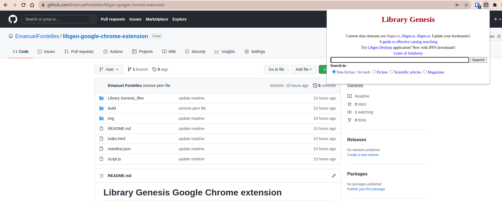
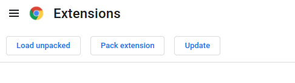

Library Genesis Google Chrome extension
=======

[](https://travis-ci.com/DoctorLai/VideoDownloadHelper)
[](https://github.com/DoctorLai/VideoDownloadHelper/blob/master/LICENSE)

Chrome Extension to improve search redirecting to Library Genesis right on the way. Made by [@emanuelfontelles](https://www.linkedin.com/in/emanuelfontelles/). The `genlib` is a Chrome Extension that helps you search your favorite files, books, pdf, epub and a lot of more stuff. 




# Chrome WebStore
On 26/Apr/2022, Google has published the extension, which is available at [Chrome Web Store](https://chrome.google.com/webstore/detail/library-genesis/oilaaekphjbkahcplbolaglkhbfimdfo?hl=en).

The last version can always be found in [libgen-google-chrome-extension](https://github.com/EmanuelFontelles/libgen-google-chrome-extension).

# Unit Tests
Unit tests are based on `mocha` and `chai`.  ~~Run all tests: `npm run test`~~ Not implemented yet.

# Install Unpacked Versions
- Download the repository and then you can load unpacked version in Chrome. (under development mode)

## 1st step:
```bash
git clone https://github.com/EmanuelFontelles/libgen-google-chrome-extension.git
```

## 2nd step:
- Go to Google Chrome extension on settings panel


- Activate `Developer mode`;

- Load unpacked extension and select the downloaded folder done in `1st step`;



- `libgen-extension` it has been installed in your Google Chrome.

# Install on Firefox or other browsers?
It should work, but not fully tested on Firefox via [Chrome Extension Foxified](https://addons.mozilla.org/en-GB/firefox/addon/chrome-store-foxified/).


# Contribution
You can create an issue if you want to:
1. report a bug
2. suggest a feature

Contributions (Pull Requests) are also welcome!


# Buy me a coffee

Thank you and if you want to help this project please donate to us.

<div style="text-align: center;">
    <a rel="nofollow" href="https://emanuelfontelles.github.io/aboutme.html" target="_blank"></a>
    <br><br>
    <form action="https://www.paypal.com/donate" target="_top">
        <input type="hidden" name="business" value="VBAS8LCQMWP34" />
        <input type="hidden" name="no_recurring" value="0" />
        <input type="hidden" name="currency_code" value="BRL" />
        <input type="image" src="https://www.paypalobjects.com/en_US/i/btn/btn_donateCC_LG.gif" border="0" name="submit"
            title="PayPal - The safer, easier way to pay online!" alt="Donate with PayPal button" />
        
    </form>
</div>